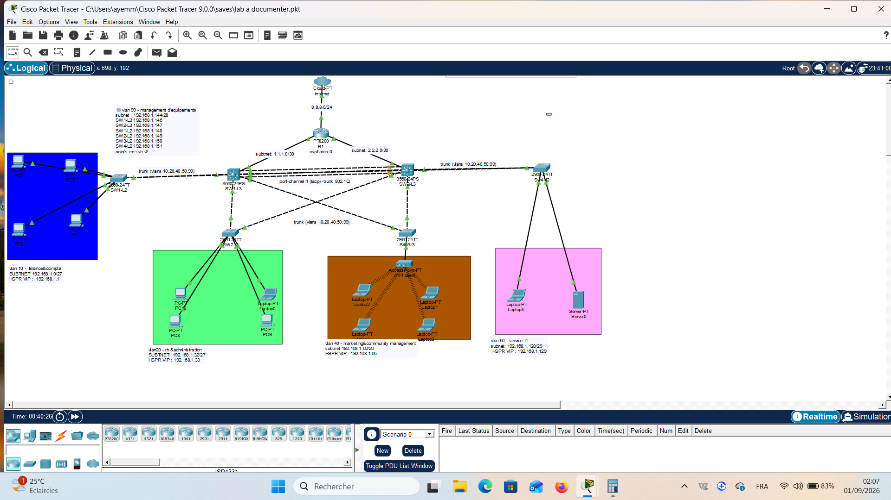

# cisco-enterprise-network-hardening
Conception, redondance L2/L3 (HSRP, LACP, OSPF) et durcissement réseau (Port Security, BPDU Guard, SSHv2) sous Cisco Packet Tracer.
# 🛡️ Conception, Redondance et Durcissement d'un Réseau d'Entreprise Multi-VLANs

> **Projet personnel / académique d'ingénierie réseau & sécurité** simulant une infrastructure d'entreprise L2/L3 complète avec haute disponibilité, routage dynamique et sécurisation avancée de la couche d'accès (*Layer 2 Hardening*).

---

## 📌 Aperçu de la Topologie Réseau

---

## 🚀 Objectifs & Fonctionnalités Techniques

L'objectif de ce projet est de concevoir et déployer une infrastructure réseau répondant aux exigences réelles du monde professionnel : **0 interruption de service (haute disponibilité)**, **isolation stricte des flux par métier** et **durcissement des accès contre les intrusions physiques et logiques**.

### 1. 🏗️ Segmentation L2 & Adressage IP (VLSM)
* **VLAN 10 (Finance & Compta) :** `192.168.1.0/27`
* **VLAN 20 (RH & Admin) :** `192.168.1.32/27`
* **VLAN 40 (Marketing) :** `192.168.1.64/26`
* **VLAN 50 (Services IT) :** `192.168.1.128/28`
* **VLAN 99 (Management Out-of-Band) :** `192.168.1.144/28`
* **Propagation automatique :** VTP v2 (Mode Server/Client, Domaine: `labo-prive`).

---

### 2. ⚡ Haute Disponibilité & Redondance L2/L3
* **Agrégation LACP (EtherChannel) :** Implémentation d'un lien `Port-channel 1` (Trunk 802.1Q) entre les deux switchs de Cœur (`SW1-L3` et `SW2-L3`) pour doubler la bande passante et tolérer la panne d'un lien physique.
* **Redondance de Passerelle (HSRP) :** 
  * `SW1-L3` configuré en **Actif** (Priorité `110`, option `preempt`).
  * `SW2-L3` configuré en **Standby** (Priorité `100`).
  * Bascule automatique et transparente des Virtual IPs (VIP) pour chaque VLAN en cas de défaillance d'un équipement de cœur.

---

### 3. 🌐 Routage Dynamique & Accès Internet
* **OSPF Area 0 :** Configuration du routage dynamique L3 entre la couche de Cœur et le routeur de bordure `R1`.
* **NAT / PAT Overload :** Traduction d'adresses pour permettre à l'ensemble des équipements du LAN d'accéder aux réseaux externes / Internet via l'IP publique de `R1`.

---

### 4. 🔒 Durcissement & Sécurité (Hardening)

#### 🛡️ Sécurisation de la Couche d'Accès (Layer 2)
* **Port Security :** Limitation du nombre d'adresses MAC autorisées sur les ports utilisateurs avec sanction (`violation shutdown` / `restrict`) pour bloquer les équipements non autorisés.
* **STP PortFast & BPDU Guard :** Activation de `portfast` pour un raccordement immédiat des hôtes et de `bpduguard` pour désactiver automatiquement (`err-disable`) tout port recevant des BPDUs suspects (protection contre les switchs pirates).
* **Isolation des Ports inactifs :** Désactivation systématique (`shutdown`) de tous les ports non assignés et rangement dans un VLAN neutre.

#### 🔐 Administration Sécurisée (Out-of-Band)
* **SSH v2 Uniquement :** Désactivation totale du protocole Telnet, génération de clés RSA 2048-bit et restriction des lignes VTY (`transport input ssh`).
* **ACLs de Management (`only-me`) :** Application d'une Access-List sur les lignes VTY autorisant exclusivement l'adresse de l'admin ** à se connecter en CLI.

---

## 🛠️ Modèles d'Équipements & Fichiers

* **Switchs de Cœur (L3) :** Cisco 3560 / Multilayer Switch
* **Switchs d'Accès (L2) :** Cisco 2960
* **Routeur de Bordure :** Cisco 1941 / 2911
* **Fichier de simulation :** Vous pouvez télécharger le fichier `.pkt` présent dans ce dépôt pour tester la topologie sous **Cisco Packet Tracer**.

---

## 👤 À propos de moi

* **Étudiant en Réseaux, Systèmes & Sécurité**
* 💡 En recherche d'opportunités (Stage / Alternance / Premier emploi)
* 🔗 **LinkedIn :** [elie ayemou](https://www.linkedin.com/in/ton-profil-ici)
* 📂 **GitHub :** [elie ayemou](https://github.com/elieayemou64-debug)
